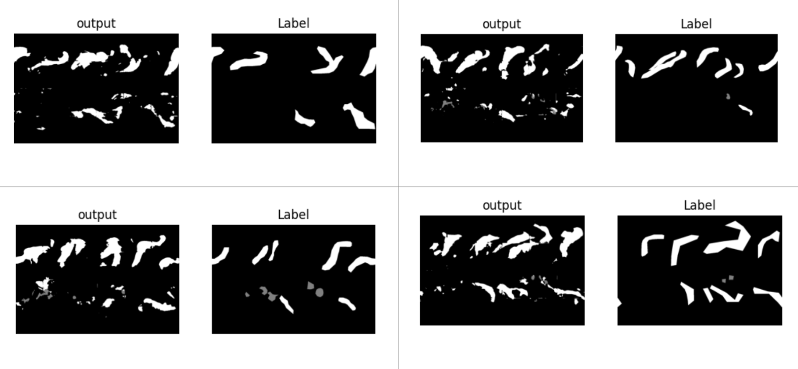

# Planet A : Climate Change

The final submitted pytorch code for the **Planet A** Challenge

## Abstract
An atmospheric river (AR) is a narrow corridor or filament of concentrated moisture in the atmosphere
[[B1]](##Reference). ARs are a major cause of flooding and landslides in the western United States, so, 
it is important to detect and track ARs.
The purpose of the ***Planet A: Climate Science Section*** is to develop a deep learning model to detect and segment the
atmospheric river and typhoon through machine learning and deep learning.
Specifically, The climate science problem is to detect atmospheric river with 16 types of climate data.
Our team built a model similar to above one except for multi-modality

## Project Structure
```
├──  data
│    └── train - train data folder
│       ├── data-1996-06-09-01-1_0.nc
│       ├── data-1996-07-11-01-1_0.nc
│       ├── ...
│       └── data-2010-10-29-01-1_0.nc
│    └── test - test data for submission
│       ├── data-2011-06-01-01-1_0.nc
│       ├── ...
│       └── data-2013-09-27-01-1_0.nc 
|
├──  train  
│    └── train.py
│
├──  result
│   ├── netname1    
│   └── netname2 ...
│
└── utils   - utility files  
    ├──  model  
    │    └── UNETpp.py  - UNET++ implementation
    │
    ├──  data_load  
    │    └── Data_Loader.py
    │    
    └── common
         ├── loss.py
         ├── plot_result.py
         └── save_reconstruction.py 
```

## Details

### Data Processing
The shape of the data was 768 and 1152, all same. Therefore, since the greatest common factor of 768 and 1152
is 192, all data will be divided into patches of 192X192 and learned. Through this, it was possible to secure a total
of 24 sheets per data and 4,440 sheets of learning data. The _get_tile_idx function inside the class finds and stores
the sliding point of the image. As a result of EDA, the pixel distribution of the entire train data could be obtained 
as a histogram. By doing so, we could decide MinMaxScaling was suitable for this data. In the case of Augmetaion such 
as Flip and Rotation, since it distorts the important characteristics of latitude and longitude of the data, we didn't
implement it.

### Train Phase

For learning, we used the Pytorch framework. A batch size of 16 was used for learning, and Adam was used as an
optimizer. 5e-4 was used as the learning rate, and the Learning Rate Decay Scheduler, which decreases by 0.95 per
epoch, was introduced. To prevent overfitting, Adam Optimizer was given a weight decay of 1e-3. Cross entropy loss
was used as the loss of learning. Cross Entropy Loss, which can manually set weights, was a great help for learning.
We used Google Lab for learning. The model had 11240875 parameters.

### Result Example



## TODO List
- Arg Parser be updated soon!

## Reference
```
[B1] Wikipedia contributors. (2022, September 19). Atmospheric river. In Wikipedia, The Free Encyclopedia. Retrieved 09:25, September 20, 2022, from https://en.wikipedia.org/w/index.php?title=Atmospheric_river&oldid=1111222086
[B1] Zhang, Yulun, et al. "Image super-resolution using very deep residual channel attention networks." Proceedings of the European conference on computer vision (ECCV). 2018.
[B2] Fang, Sheng, et al. "SNUNet-CD: A densely connected Siamese network for change detection of VHR images." IEEE Geoscience and Remote Sensing Letters 19 (2021): 1-5.
```
